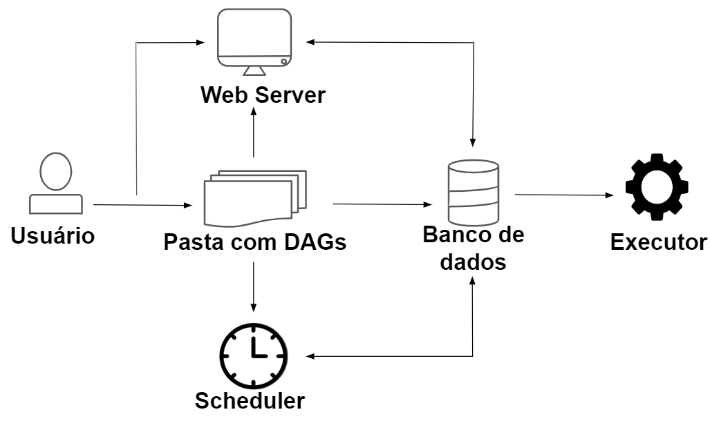

# Apache Airflow

Apache Airflow é um orquestrador de fluxos, ou seja, com ele você é capaz de decidir em qual momento e em quais condições algum programa seu irá rodar. Ele é um sistema de gerenciamento de fluxo de trabalho de código aberto (open source) projetado para criar, agendar e monitorar, de forma programática, pipelines de dados e fluxos de trabalho.

Essa ferramenta foi criada em 2014 pelo Airbnb para orquestrar os complexos fluxos de trabalho da empresa. Mas, desde o início de 2019, o Airflow se tornou um projeto de alto nível da Apache Software Foundation.

O Airflow é todo escrito em Python e possui características como: dinamicidade, extensível, escalável e adequado para lidar com a orquestração de pipelines de dados complexos.

## Principais conceitos do Airflow

O Airflow organiza seus fluxos de trabalho em DAGs, que são basicamente pipelines de dados definidos utilizando a linguagem Python. Cada DAG é composto por um conjunto de tarefas que são utilizadas para implementar uma determinada lógica no pipeline. Sendo que cada tarefa é definida pela instância de um operador.

De forma resumida, os principais conceitos do Airflow são:

* DAG: fluxo de trabalho definido em Python.
* Task: unidade mais básica de um DAG.
* Operator: encapsula a lógica para fazer uma unidade de trabalho (task).

Caso queira saber mais sobre o Airflow e seus conceitos, sugiro a leitura da documentação:

* [Apache Airflow Documentation](https://airflow.apache.org/docs/apache-airflow/2.3.2/)
* [Apache Airflow Project](https://airflow.apache.org/docs/apache-airflow/2.3.2/project.html)

## Arquitetura

A instalação do Airflow geralmente consiste nos seguintes componentes principais:

* **Webserver**: apresenta uma interface de usuário que nos permite inspecionar, acionar e acompanhar o comportamento dos DAGs e suas tarefas;
* **Pasta de arquivos DAG**: armazena os arquivos DAGs criados. Ela é lida pelo agendador e executor;
* **Scheduler (agendador)**: lida com o acionamento dos fluxos de trabalho (DAGs) agendados e o envio de tarefas para o executor;
* **Banco de dados**: usado pelo agendador, executor e webserver para armazenar os metadados e status do DAG e suas tarefas;
* **Executor**: lida com as tarefas em execução. O Airflow possui vários executores, mas apenas um é utilizado por vez.

Além desses principais, existem alguns componentes situacionais que são usados por alguns executores específicos apenas para executar tarefas ou fazer uso de determinados recursos. Como curiosidade, deixo a explicação de um desses componentes aqui:

* **Worker**: processo que executa as tarefas conforme definido pelo executor. Dependendo do executor escolhido, você pode ou não ter workers (trabalhadores) como parte da infraestrutura do Airflow.

Todos esses componentes se relacionam de alguma maneira, formando a arquitetura do Airflow.

Caso queira se aprofundar na arquitetura do Airflow, consulte a documentação:

* [Architecture Overview](https://airflow.apache.org/docs/apache-airflow/2.3.2/concepts/overview.html)