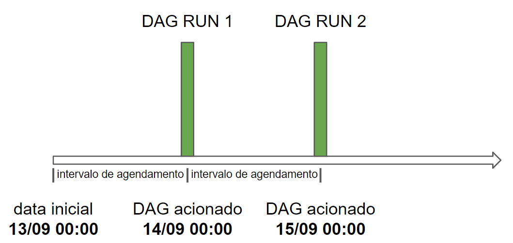

# Dags, Tasks, Operators, Agendamentos, Jinja Templates e Variáveis Dinâmicas


DAG é uma abreviação para “Directed Acyclic Graphs” - Grafos Acíclicos Dirigidos, em tradução livre - sendo que cada uma dessas palavras significa:

* **Grafos**: ferramenta matemática na qual há nós e arestas responsáveis por conectar esses nós;
* **Direcionado**: indica que o fluxo de trabalho se dá apenas em uma direção; e
* **Acíclico**: significa que a execução não entrará em um laço de repetição. Então, eventualmente, acabaremos em um nó final que não estará conectado com o nó inicial.

A grande ideia do Airflow é dividir um trabalho grande, com uma ou mais etapas, em “tarefas” individuais que chamaremos de tasks que juntas formam um DAG. Cada **task** é responsável por implementar determinada lógica no pipeline.

Dessa forma, podemos dizer que um DAG é basicamente um conjunto de tarefas. Sendo cada tarefa a unidade mais básica de um DAG.

Caso queira se aprofundar nesse conceito, sugiro a leitura da documentação e de um artigo que temos aqui na plataforma:

* [DAGs - Documentação](https://airflow.apache.org/docs/apache-airflow/1.10.12/concepts.html#dags);
* [Airflow - Entendendo os DAGs](https://www.alura.com.br/artigos/airflow-entendendo-dags). 

## Operators

Os operadores são classes Python que encapsulam a lógica para fazer uma unidade de trabalho, ou seja, uma tarefa. Eles definem as ações que serão concluídas para cada unidade de trabalho e abstraem muito código que teríamos que escrever. Quando instanciamos um operador e passamos os parâmetros necessários, a instância desse operador passa a ser uma tarefa.

Existem muitos tipos diferentes de operadores disponíveis no Airflow e o trabalho que cada um faz varia muito. Alguns dos operadores mais usados são:

* **PythonOperator**: executa uma função Python;
* **BashOperator**: executa um script bash;
* **KubernetesPodOperator**: executa uma imagem definida como imagem do Docker em um pod do Kubernetes;
* **SnowflakeOperator**: executa uma consulta em um banco de dados Snowflake;
* **EmailOperator**: envia um e-mail.

O Airflow tem um conjunto muito extenso de operadores disponíveis. No entanto, se não existir um operador para seu caso de uso, você também pode criar os seus próprios operadores.

Um operador possui 3 **características** principais:

1) **Idempotência**: independentemente de quantas vezes uma tarefa for executada com os mesmos parâmetros, o resultado final deve ser sempre o mesmo;

2) **Isolamento**: a tarefa não compartilha recursos com outras tarefas de qualquer outro operador;

3) **Atomicidade**: a tarefa é um processo indivisível e bem determinado.

Para mais informações sobre os operadores, acesse a documentação:

* [Operators](https://airflow.apache.org/docs/apache-airflow/2.3.2/concepts/operators.html)


## Agendamento no Airflow

Um dos recursos mais fundamentais do Apache Airflow é a capacidade de agendar trabalhos. Dessa forma, é importante conhecermos alguns termos do Airflow que são relacionados ao agendamento:

* **Data de início (start date)**: data em que o DAG começa a ser agendado. Essa data é o início do intervalo de dados que você deseja processar;

* **Intervalo de agendamento (schedule interval)**: define o intervalo de tempo em que o DAG é acionado. Por exemplo, "@daily" significa que o DAG deve ser acionado todos os dias à meia-noite;

* **Intervalo de dados (data interval)**: propriedade de cada DAG Run que representa o intervalo de tempo em que cada tarefa deve operar. Por exemplo, para um DAG agendado de dia em dia, cada intervalo de dados começará no início (00:00) e terminará no final do dia (23:59). A execução do DAG acontece no final do intervalo de dados;

* **Data lógica (logical date)**: é a mesma do início do intervalo de dados. Não representa quando o DAG será realmente executado. Antes do Airflow 2.2, era chamada de data de execução.

É importante ressaltar que o DAG só é acionado após a data de início + o intervalo de agendamento, ou seja, no final do intervalo de dados. Por exemplo: se temos um DAG com a data de início igual a 13/09 e com o schedule interval igual a "@daily", indicando que ele deve ser executado todos os dias à meia noite, sua dinâmica de execução vai ser a seguinte:



Para mais informações, consulte a documentação:

* [Scheduler](https://airflow.apache.org/docs/apache-airflow/2.2.3/concepts/scheduler.html);
* [DAG Runs](https://airflow.apache.org/docs/apache-airflow/2.2.3/dag-run.html).

## Jinja Templates

O Jinja é uma estrutura de modelagem em Python utilizada pelo Airflow como seu mecanismo de modelagem, o que nos permite ter acesso à informações em tempo de execução. Há diversas variáveis que podem nos trazer dados em tempo de execução, veremos algumas delas.

Cada DAG run possui um intervalo de datas composto por uma inicial e outra final, representadas pelas variáveis "data_interval_start" (ou "ds") e "data_interval_end", respectivamente, e é possível acessá-las em tempo de execução. Para que possamos utilizá-las no tempo de execução do nosso código, precisamos defini-las entre chaves duplas {{ }}. Exemplo:

```python
bash_command = 'mkdir -p "~/Documents/airflow/pasta={{data_interval_end}}" '
```

## Variáveis Dinâmicas

A modelagem no Airflow nos permite passar informações dinâmicas para as instâncias de tarefa em tempo de execução. Vamos usar, como exemplo, a tarefa que fizemos anteriormente:

```python
 tarefa_4 = BashOperator(
        task_id = 'cria_pasta',
        bash_command = 'mkdir -p "~/Documents/airflow/pasta={{data_interval_end}}" '
      )
```

Neste exemplo, o valor entre as chaves duplas {{ }} é nosso código modelo a ser avaliado em tempo de execução. O conteúdo retornado pela variável data_interval_end é a data final do intervalo de dados, ou seja, a data de acionamento do DAG.

O Airflow utiliza o Jinja, uma estrutura de modelagem em Python, como seu mecanismo de modelagem. Vamos conhecer mais algumas variáveis que podemos utilizar em tempo de execução:

* **data_interval_start**: data do início do intervalo de dados;
* **data_interval_end**: data do fim do intervalo de dados;
* **ds**: data lógica de execução do DAG;
* **ds_nodash**: data lógica de execução do DAG sem nenhuma separação por traços.

O Airflow inclui muitas outras variáveis ​​que podem ser usadas para modelagem. Caso queira conhecê-las, consulte a documentação:

* [Templates reference](https://airflow.apache.org/docs/apache-airflow/2.3.2/templates-ref.html)