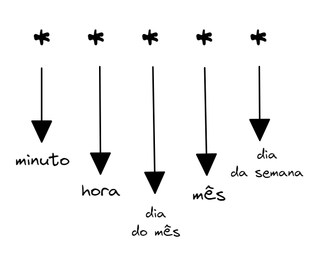

# Cron Expressions e XCOM

Quando queremos definir intervalos de tempo um pouco mais complexos para a execução do nosso DAG, o Airflow permite a utilização das chamadas Cron Expressions. A sintaxe delas consiste em 5 componentes:



Sendo os valores possíveis para cada um desses componentes:

* **minuto**: 0-59;
* **hora**: 0-23;
* **dia do mês**: 1-31;
* **mês**: 1-12;
* **dia da semana**: 0-6 representando de domingo a sábado.

No caso do nosso DAG, queremos que ele seja executado toda segunda-feira do mês, às 00h00. Por isso, passamos a seguinte Cron Expression para o parâmetro schedule_interval:

```python
schedule_interval = 0 0 * * 1
```

Caso queira conhecer mais sobre essas expressões, deixo a sugestão do texto explicativo abaixo:

* [CRON expression](https://en.wikipedia.org/wiki/Cron#CRON_expression)

## XComs: passando informações entre tasks

Muitas das vezes, quando estamos desenvolvendo um DAG, precisamos compartilhar dados entre as tarefas existentes. Um exemplo de uma situação que precisaríamos fazer isso, seria no desenvolvimento de um DAG que realiza o processo de ETL, ou seja, de extração, transformação e carregamento de dados.

Em um pipeline desse, precisaríamos ter uma tarefa para cada uma das 3 etapas. Dessa forma, seria necessário compartilhar os dados de uma tarefa para a outra. Existem alguns métodos que podemos usar para implementar o compartilhamento de dados entre nossas tarefas do Airflow. O método que vamos conhecer para passar dados entre as tarefas do Airflow é usar o XCom.

O XCom é um recurso nativo do Airflow para compartilhar dados de tarefas. Esse recurso permite que as tarefas troquem metadados de tarefas ou pequenas quantidades de dados. Eles são definidos por chave, valor e data.

Os XComs podem ser enviados (xcom.push) ou recebidos (xcom.pull) por uma tarefa. Quando enviado por uma tarefa, ele é armazenado no banco de dados do Airflow e fica disponível para todas as outras tarefas.

Esse recurso deve ser utilizado apenas para passar pequenas quantidades de dados entre as tarefas. Ele não foi projetado para passar dados como DataFrames ou semelhantes. Para casos como esse, podemos utilizar o armazenamento de dados intermediário, que é mais apropriado para grandes blocos de dados.

Você pode encontrar mais informações sobre isso acessando a documentação: [Custom XCom Backends](https://airflow.apache.org/docs/apache-airflow/2.3.2/concepts/xcoms.html#custom-xcom-backends). E, caso queira aprender mais sobre os XComs e como implementá-los, acesse a documentação: [XComs](https://airflow.apache.org/docs/apache-airflow/2.3.2/concepts/xcoms.html#xcoms).