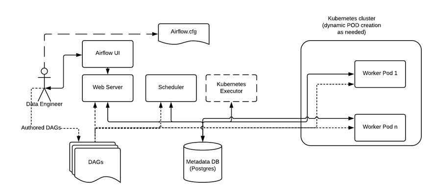

# Airflow no Kubernetes

Fizemos a configuração de todo o ambiente Kubernetes na nossa máquina. Mas, para conseguirmos criar um ambiente Airflow no Kubernetes, da forma que precisamos, teremos que fazer mais algumas configurações.

Para que possamos entender o propósito de cada configuração, passaremos pela arquitetura do Airflow utilizando o executor Kubernetes. A imagem a seguir, retirada da própria documentação do Airflow, nos traz a estruturação.



À esquerda, o desenho de uma pessoa identificado como "Data Engineer". Ao centro, alguns retângulos, sendo 3 dispostos horizontalmente, lado a lado, com os respectivos textos: "Web Server", "Scheduler" e "Kubernetes Executor". Acima de "Web Server", um retângulo identificado como "Airflow UI", e, abaixo, um retângulo com aresta inferior ondulada denominado "DAGs". Na diagonal direita de "Airflow UI", retângulo com aresta inferior ondulada escrito "Airflow.cfg". À direita de "DAGs", um cilindro de nome "Metadata DB (Postgres)". À direita da imagem um quadro de título "Kubernetes cluster (dynamic POD creation as needed)" com dois retângulos, um em cima do outro. No retângulo superior, está escrito "Worker Pod 1"; no inferior, "Worker Pod n". Uma seta interliga "Data Engineer" à "Airflow.cfg". Ligando "Data Engineer" e "Airflow UI", uma linha com setas em ambas as pontas. Ainda de "Data Engineer", sai um tracejado que perpassa o texto "Authored DAGs", do qual segue uma seta até "DAGs". De "DAGs", sai uma linha para "Web Server" e uma para "Worker Pod n", da qual se ramificam setas para "Scheduler" e "Worker Pod 1". De "Airflow UI", uma seta para "Web Server". Uma linha com setas nas pontas liga "Web Server" à "Worker Pod 1"; no caminho, setas saem desta linha e direcionam-se para "Scheduler" e "Kubernetes Executor". Entre "Metadata DB (Postgres)" e "Worker Pod n", uma linha com setas nas pontas.

Parte dessa arquitetura já nos é familiar, pois trata-se da arquitetura básica do Airflow, mas vamos relembrá-la.

Temos o usuário que pode acessar tanto a pasta com os arquivos dos DAGs, quanto a interface do Airflow por meio da execução do webserver. Além disso, teremos o banco de dados de metadados responsável por armazenar as informações sobre cada um dos DAGs e suas respectivas tarefas.

O Scheduler, nosso agendador, deve verificar, no banco de dados, o status de cada tarefa e decidir o que precisa ser feito e em qual ordem. Trabalhando em estreita colaboração com o Scheduler, o Executor será responsável por descobrir quais recursos realmente concluirão as tarefas à medida que estas forem sendo agendadas pelo scheduler.

Agora, entenderemos melhor como funciona o executor Kubernetes.

Quando um DAG enviar uma tarefa para ser executada, o Kubernetes vai solicitar à sua própria API que um novo pod de trabalho seja criado para a execução dessa tarefa. Uma vez que o pod executar a tarefa, deve relatar o status final da task para o banco de dados de metadados e ser finalizado. Este será o processo para cada uma das novas tarefas que forem enviadas para execução. Sendo assim, sempre teremos um nov pod sendo criado para executar uma nova tarefa, e após executá-la, será finalizado.

Vamos pontuar as vantagens de utilizar este executor!

* **Alto nível de elasticidade**: o nosso cluster Airflow não será mais estático, e sim dinâmico. Isso porque ele se expande e diminui de acordo com a carga de trabalho do momento. Vamos supor, por exemplo, que temos 5 tarefas para serem executadas. Neste caso, teremos, também, 5 pods, 1 para cada tarefa. Uma vez que as tasks forem executadas, esses pods vão deixar de existir, então não permanecerão parados alocando recursos desnecessários;

* **Configuração do pod no nível da tarefa**: como sabemos, o executor Kubernetes cria um novo pod para cada nova tarefa que precisa ser executada. Dessa forma, é possível especificar, com mais precisão, os recursos que cada um dos pods utilizará de acordo com as necessidades da tarefa que precisa executar;

* **Tolerância a falhas**: como cada tarefa terá seu próprio pod de execução, caso uma delas venha a falhar, isso não deve travar todo o fluxo de trabalho.


## Celery x Kubernetes Executor


Quando você precisar escolher em qual arquitetura instalar o Airflow, leve em consideração os prós e contras de cada executor.

### Tarefas sensíveis ao horário de execução

Em situações que temos tarefas sensíveis ao horário de execução, o executor Kubernetes não é tão interessante de ser utilizado. Isso porque, utilizando esse executor, as tarefas podem demorar até alguns minutos para começar a executar, pois o Airflow precisa esperar o tempo para que um novo pod seja instanciado no cluster toda vez que uma nova tarefa é executada. Isso significa que recursos precisam ser alocados e uma nova imagem do Airflow precisa ser configurada e iniciada naquele container, para então a tarefa ser executada.

Já utilizando o executor Celery, as tarefas são executadas quase instantaneamente após serem disparadas pelo Scheduler. Isso porque os workers do Celery estão sempre ativos e esperando as tarefas para serem executadas.

### DAGs com frequência de execução não contínua

Por outro lado, caso os DAGs tenham uma frequência de execução não contínua ou bastante esparsa, recursos podem ser economizados ao utilizar o executor Kubernetes. Isso acontece, pois ele consegue escalonar os Pods para zero, já que os Pods são iniciados somente quando há tarefas a serem executadas, enquanto no Celery os workers ficam executando continuamente esperando por tarefas.

Sendo assim, podemos dizer que o principal motivo para utilizar o executor Kubernetes é focado na possibilidade de configurar recursos que serão alocados para cada tarefa, algo que não é possível de ser feito no Celery. Com o Kubernetes podemos especificar por tarefa a quantidade de CPU e memória que serão alocados para o pod, assim como volumes e imagens.

Para mais informações, acesse as documentações:

* [Kubernetes Executor](https://airflow.apache.org/docs/apache-airflow/2.4.1/executor/kubernetes.html)
* [Celery Executor](https://airflow.apache.org/docs/apache-airflow/2.4.1/executor/celery.html)


## Volumes Persistentes

Armazenamentos locais, em containers ou pods, são efêmeros, ou seja, eles têm uma vida curta junto ao container. Isso significa que quando o container é encerrado, todos os dados são apagados com ele.

Desta maneira, se queremos que os dados estejam desacoplados do container, ou seja, que mesmo quando o container for encerrado, os dados permaneçam salvos, precisamos criar os volumes persistentes ou PV (Persistent Volume).

Os volumes persistentes são uma parte do armazenamento do cluster. É como se criássemos pastas dentro do nosso cluster para salvarmos e armazenarmos dados, além de compartilharmos informações entre os pods.

No caso do nosso cluster, será importante ter, no mínimo, três volumes persistentes:

* airflow-dags-volume: armazenar os arquivos de DAGs

* airflow-logs-volume: arquivar os logs gerados pelo Airflow quando for executado

* airflow-data-volume: armazenar os arquivos que forem extraídos pelo DAG

Para criar esses volumes, é necessário definir um arquivo YML, contendo todas as configurações desejadas para eles. Antes, vamos criar uma pasta na nossa máquina, para organizarmos todos os arquivos do curso em subpastas dentro dela. 

Você encontra o mapeamento de volumes no arquivo aula_5_1_airflow_config.yml

### O que são PVs e PVCs?


#### Persistent Volume - PV

Armazenamento local em containers/Pods são efêmeros, ou seja, eles têm uma vida curta junto com um container. Isso significa que quando um container é encerrado todos os dados são apagados junto com ele.

Dessa forma, tanto no Docker como no Kubernetes, quando precisamos que os dados estejam desacoplados do container, ou seja, que mesmo quando finalizamos o container os dados continuem salvos, nós precisamos criar os chamados volumes persistentes ou PV (de Persistent Volume).

Esses volumes persistentes são uma parte do armazenamento do cluster, são como "pastas" que nós criamos dentro do cluster para conseguirmos armazenar nossos dados e também compartilhar informações entre os Pods.

#### Persistent Volume Claim - PVC

Os PVCs, de Persistent Volume Claim, são os objetos de reivindicação de volume. Eles são responsáveis por "pegar" um pedaço do armazenamento disponível em um Persistent Volume e disponibilizar para algum Pod específico. Ou seja, um PVC é uma forma de um Pod ter acesso a um determinado pedaço de armazenamento que foi proporcionado por um PV específico.

Para saber mais sobre esses tópicos, sugiro a leitura do artigo: [Kubernetes: conhecendo a orquestração de containers](https://www.alura.com.br/artigos/kubernetes-conhecendo-orquestracao-containers)


### Criando os volumes

Com o minikube iniciado:

```shell
minikube start
```

```shell
minikube dashboard
```

O comando de aplicação das configurações do arquivo YML é:

```shell
minikube kubectl -- apply -f aula_5_1_airflow_config.yml
```

 Para conferirmos se eles foram todos criados corretamente, podemos acessar a dashboard do kubernetes.

Precisamos retornar ao Terminal anterior e localizar o link da dashboard. Pressionaremos a tecla "Ctrl" e selecionaremos esse link. Com isso, abriremos a dashboard do Kubernetes.

Para acessarmos os volumes é necessário, primeiro, acessar o namespace do airflow, que é onde foram criados. Podemos alterar o namespace acessando a barra superior da dashboard, "default". Vamos apertar a seta para baixo e localizar o outro namespace que acabamos de criar, o "airflow".

Agora estamos no namespace airflow. Na barra lateral esqueda do dashboard, localizaremos o "Persistent Volumes" na seção de "Cluster". Ao selecioná-lo, encontraremos os nossos três volumes: airflow-dags-volume; airflow-data-volume; e airflow-logs-volume. 

Ao aplicarmos as configurações do arquivo YAML para a criação dos volumes no nosso cluster é comum acontecer um pequeno erro e nossos PVCs acabarem ficando vinculados aos PVs incorretos. Nesse caso, devemos excluir os PVCs e os PVs e criar eles novamente para que sejam criados de forma correta.

### Montando volumes

Criamos todos os nossos volumes persistentes e agora precisamos vincular cada um deles a pastas específicas da nossa máquina. Assim, essas pastas poderão acessar os dados que estiverem sendo salvos nos volumes, da mesma forma que estes volumes terão acesso aos dados das pastas. A seguir, acompanharemos um exemplo da importância disso.

Vamos supor que o airflow já está todo configurado e instalado no Kubernetes. Precisamos criar os arquivos de dag, no entanto, eles serão todos gerados na nossa máquina, em alguma pasta específica.

Como o airflow rodará no kubernetes, ele não terá acesso direto a esses arquivos de dag que gerados na máquina. Por outro lado, se montarmos uma pasta para o volume de dags, o airflow conseguirá acessar os dados da pasta por meio do seu volume.

Por isso é importante estabelecer esse vínculo. O mesmo raciocínio vale para o volume de logs e de data. 

```shell
minikube mount ./dags/:/data/dags
```

```shell
minikube mount ./logs/:/data/logs
```

```shell
minikube mount ./data/:/data/data
```

Execute uma dag de criação de arquivo e confira se há algum arquivo no diretório data/dags